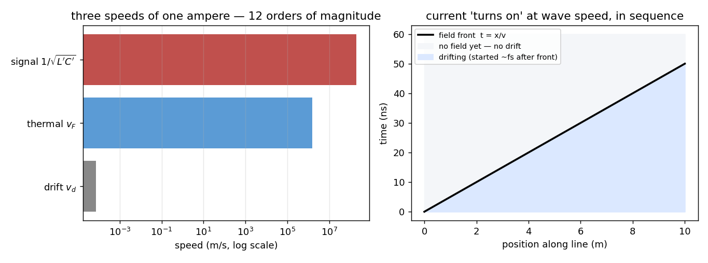
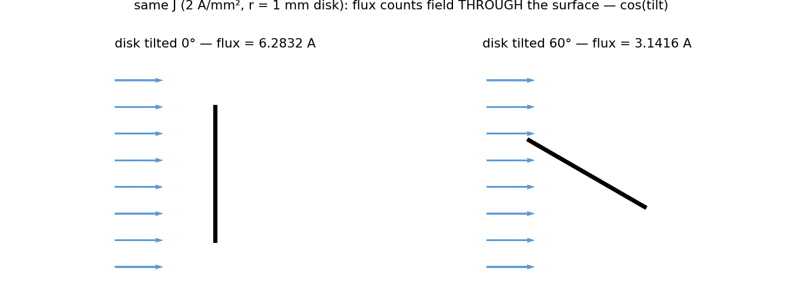
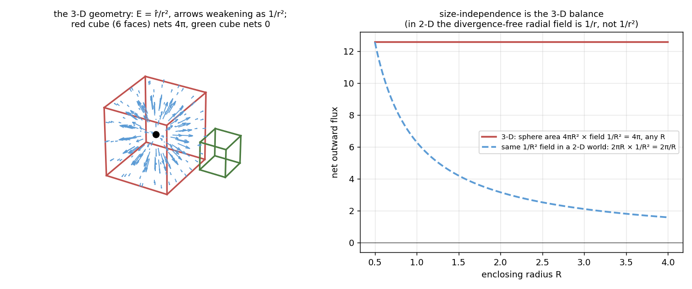
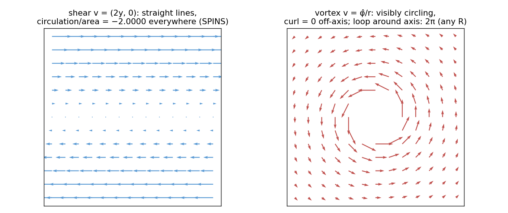
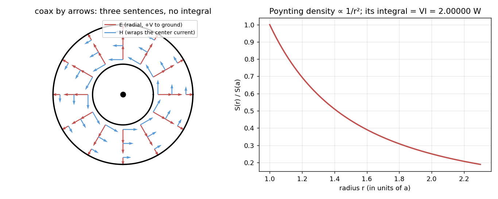
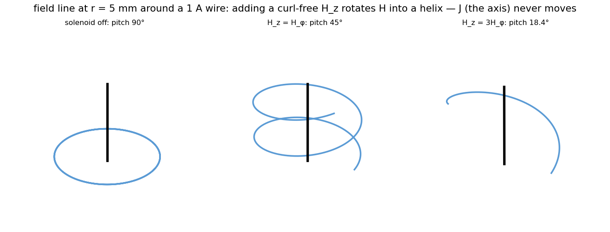
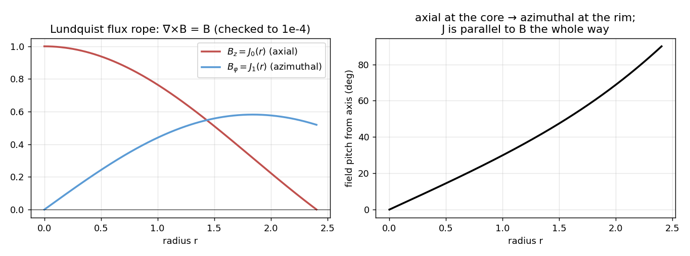

# Chapter 0 — Maxwell as Arrows

*Reading the field equations for direction and topology before calculating
anything. Every number below can be recomputed: run `python tour_numbers.py all`
and every table reappears; run `python tour_figures.py` and every figure
regenerates. No solver library, no scikit-rf — this chapter is the tool you
carry when the software isn't there, and the intuition the software cannot
supply when it is.*

**Who this is for.** You took an electromagnetics course once. You can compute a
divergence and a curl if pressed, and you passed the exam. What that course
often does not leave behind is the ability to *read* Maxwell's equations — to
look at a coax, a microstrip, a slot, a loop, and know which way every field
points and where the power goes, before and without calculation. Lectures 1–16
assume that ability in small doses. This chapter builds it deliberately: §0.0
states the four equations once, properly, in both their costumes; then six
questions, each answered by hand and then confirmed by a number.

**The cast** (you will meet them in order, and they return all course):

| | Question | Why it exists |
|---|---|---|
| 0.0 | the four equations, stated | the protagonists — differential and integral forms, units audited, sources on the right, behavior on the left |
| 0.1 | how fast does current travel? | three speeds hide in one ampere — untangling them is transmission-line theory's admission ticket |
| 0.2 | what is a "flux," really? | one integral template serves J, B, D, Poynting, and the radar equation |
| 0.3 | what does divergence measure? | outflow density — and the field that looks maximally diverging but isn't |
| 0.4 | what does curl actually measure? | circulation density — and two flows that break your intuition on purpose |
| 0.5 | can arrows alone solve a problem? | coax power flow in three sentences; the barber pole that breaks perpendicularity |
| 0.6 | what fills the empty slot in Faraday's law? | magnetic current: absent in nature, indispensable in antenna engineering |

---

## 0.0 The protagonists — the four equations, stated once, properly

Everything in this chapter (and this course) is commentary on four lines.
Here they are in both costumes — the **differential form** (true at a point)
and the **integral form** (true for any loop or closed surface you draw) —
each with its plain-language reading, which the rest of the tour unpacks:

| Name | Differential form | Integral form | Read as |
|---|---|---|---|
| Gauss (electric) | ∇·D = ρ | ∯ D·dA = Q_enc | E/D lines start on + charge, end on − charge |
| Gauss (magnetic) | ∇·B = 0 | ∯ B·dA = 0 | B lines never end — no magnetic charge exists (§0.6) |
| Faraday | ∇×E = −∂B/∂t | ∮ E·dl = −dΦ_B/dt | E circulates around *changing* magnetic flux, opposing it |
| Ampère–Maxwell | ∇×H = J + ∂D/∂t | ∮ H·dl = I_enc + dΦ_D/dt | H circulates around current — real (J) or displacement (∂D/∂t) |

**Reading the integral-form shorthand.** The two Gauss rows integrate over a
**closed** surface (∯ — a box, a balloon: anything with an inside), and the
subscript **enc means "enclosed" by that surface**: Q_enc is the total charge
inside it. The two curl rows walk a **closed loop** (∮) and integrate over any
**open** surface spanning that loop (a drumhead with the loop as its rim):

- **Φ_B = ∫ B·dA** — the magnetic flux through the drumhead (webers);
- **Φ_D = ∫ D·dA** — the electric flux through it (coulombs);
- **I_enc = ∫ J·dA** — the conduction current threading the loop (amperes) —
  "enclosed" here meaning *piercing the drumhead*, linked through the loop
  like a ring through a keyring.

Loop direction and surface normal are tied by the right-hand rule (fingers
around the loop, thumb along dA). §0.2 is devoted to what these ∫F·dA
"flux" integrals mean; for now, read each one as "how much of the field
passes through."

**The cast of symbols**, with units:

| Symbol | Name | Units |
|---|---|---|
| E | electric field | V/m |
| D = εE | electric flux density | C/m² |
| H | magnetic field | A/m |
| B = μH | magnetic flux density | T = Wb/m² |
| J | current density (§0.1–0.2; in a conductor J = σE) | A/m² |
| ρ | charge density | C/m³ |

The three material relations on the right of the symbol table — **D = εE,
B = μH, J = σE** — are the *constitutive relations*: Maxwell's equations are
deliberately material-blind, and ε, μ, σ are where the substance (substrate,
ferrite, copper) plugs in. Lecture 5 lives in ε; lecture 5's loss lives in σ;
§0.1's Drude model is where J = σE comes *from*.

**Audit the units before believing anything** — every spatial derivative (∇)
divides by one meter, and both sides of each equation must agree:

| Equation | Field units | Both sides |
|---|---|---|
| ∇·D = ρ | D: C/m² | → C/m³ — a volume charge density ✓ |
| ∇·B = 0 | B: Wb/m² | → Wb/m³ = 0 ✓ |
| ∇×H = J + ∂D/∂t | H: A/m | → A/m² = J ✓; ∂D/∂t: (C/m²)/s = A/m² ✓ |
| ∇×E = −∂B/∂t | E: V/m | → V/m²; ∂B/∂t: (Wb/m²)/s = V/m² ✓ |

The audit is trivial, but its two by-products are not: curl H having J's units
is Stokes' theorem in disguise (circulation per area must be amperes per
area — §0.4 makes this exact), and ∂D/∂t is the *only* object with J's units
available to keep Ampère's law consistent where no charge flows — Maxwell's
displacement current, found by bookkeeping.

Three observations before we use them, each of which becomes a section:

1. **The two columns say the same thing at different sizes.** The integral
   forms count totals over loops and surfaces you choose; the differential
   forms are those totals shrunk to a point, divided by volume or area —
   divergence is flux-per-volume (§0.3), curl is circulation-per-area
   (§0.4). Gauss's divergence theorem and Stokes' theorem are the two
   elevators between the columns.
2. **The right-hand sides are the sources; the left-hand sides are the field
   behavior they compel.** Charge makes field lines end; current (or changing
   D) makes them wrap; changing B makes E wrap the other way; and nothing
   makes B lines end, ever. That is the entire content of the arrow rules of
   §0.5 — the equations *are* the rules.
3. **One slot is conspicuously empty.** Faraday's law has no magnetic-current
   term partnering J, and Gauss-magnetic's zero is the reason. Whether the
   symmetry can be rented anyway is §0.6's story.

*(Notation: this course writes the field pair as (E, H) with the flux
densities (D, B) — Pozar's convention, natural at material boundaries where
tangential E, H are the continuous pair. Physics texts often prefer (E, B);
nothing below depends on the choice.)*

---

## 0.1 Three speeds of one ampere

Push 1 A through a 1 mm² copper wire and ask the naive question: *how fast is
the current moving?* The honest answer is that three utterly different speeds
are hiding in that sentence, and confusing them is the most common broken
intuition in electrical engineering.

**Speed one — the drift.** Copper donates one conduction electron per atom:
n = 8.49×10²⁸ carriers per cubic meter. Current is I = n·q·v_d·A, so the net
carrier velocity needed for our ampere is

> v_d = I / (nqA) = **7.35×10⁻⁵ m/s = 0.0735 mm/s.**

A snail outruns it. An electron entering your wire at the wall crosses one
meter in **3.8 hours**.

**Speed two — the thermal churn.** Each electron individually is *fast* —
in copper the Fermi velocity is about 1.57×10⁶ m/s — but in random directions
that cancel. The drift is a 10⁻¹⁰-level bias on top of this churn: an enormous
crowd shuffling almost imperceptibly in one direction, moving a coulomb per
second because the crowd is astronomically large.

**Speed three — the signal.** Change the source, and how fast does the far end
find out? On an RG-58-class line (L′ = 250 nH/m, C′ = 100 pF/m):

> v = 1/√(L′C′) = **2.00×10⁸ m/s = 0.667 c.**

The signal crosses the meter in 5.0 ns — **twelve to thirteen orders of
magnitude** faster than the drift (measured ratio: 2.7×10¹²).

**How all three coexist — the mechanism, in three steps:**

1. **The wire is already full.** Current does not require electrons to travel
   from source to load; it requires the electron sea *everywhere along the
   wire* to start creeping. A garden hose already full of water delivers at
   the nozzle the moment you open the tap — a pressure wave, not your water,
   crossed the hose.
2. **What travels fast is the field, and it travels outside the copper.** A
   thin rearrangement of surface charge races along the conductors,
   establishing E at each point; that field-and-charge pattern is a guided
   electromagnetic wave living in the *dielectric between* the conductors —
   which is why v is set by the insulation (1/√(L′C′)), not by anything
   about the metal.
3. **The local response is effectively instantaneous.** The Drude relaxation
   time in copper is τ = mσ/(nq²) = **2.5×10⁻¹⁴ s**; the drift settles within
   ~5τ ≈ **125 femtoseconds** of the field's arrival. So drift switches on
   *in sequence* down the line, at wave speed, with negligible local lag —
   current "appears" at the far end at 0.667 c while nothing charged ever
   exceeds a slow walk. Three claims, three speeds, no contradiction.

*(The τ above comes from the Drude model, σ = nq²τ/m — the microscopic origin
of Ohm's law, and of lecture 5's skin effect. Enrichment, not prerequisite:
the course needs only the conclusion that the local response is instant and
the traveling thing is the wave.)*

---

## 0.2 Flux is an integral, not a motion

The word "flux" (Latin *fluxus*, flow) suggests something streaming. Strip the
suggestion away: for any vector field F, the **flux through a surface** is

> Φ = ∫ F·dA

— "how much of F crosses this surface, counting direction" — and F itself is
then the **flux density** (the per-area integrand). The word names the *shape
of the integral*, not any physical motion. Magnetic flux ∫B·dA threads a loop
with no magnetic substance moving; the ammeter's plain I is secretly
∫J·dA, the flux of current density through the wire's cross-section.

Run the check by hand. A uniform J = 2 A/mm² crosses a 1 mm-radius disk:

| disk orientation | flux (measured) |
|---|---|
| perpendicular | I = J·A = **6.2832 A** |
| tilted 60° | I = J·A·cos 60° = **3.1416 A** (numerical surface integral: 3.1402) |

Same field, same disk — the flux changed because flux measures
*field-through-surface geometry*. Nothing moved differently.

**Why one word serves so many masters.** You will use this template weekly:

| Quantity | Flux density (per m²) | Its flux (the integral) |
|---|---|---|
| charge transport | J (A/m²) | current I |
| magnetic field | B (T = Wb/m²) | magnetic flux Φ — Faraday's law |
| electric field | D (C/m²) | Gauss's enclosed-charge count |
| power | Poynting S (W/m²) | power through a surface |
| radar illumination | P_tG/4πR² (W/m²) | power intercepted by an RCS σ |

That last row is lecture 1's radar equation: "power density at the target" is
a power flux density, and "the target intercepts σ of it" is a flux integral
over an effective area. Gauss and Friis, one grammar.

**One naming collision to defuse now:** electromagnetics also has a genuine
*surface current density* K (A/m) — current confined to a thin sheet, as in
skin-effect idealizations and boundary conditions. Note the units: amperes per
meter of sheet *width*, current *on* a surface. J (A/m²) is current *through*
a surface. Different objects, and the reason nobody calls J a "surface
density."

---

## 0.3 Divergence is flux density

Section 0.2 defined flux through a surface you choose. Close the surface —
make it a box, a balloon, any envelope with an inside — and ask for the *net
outward* flux. Divergence is that quantity shrunk to a point:

> ∇·F = lim_{V→0} (1/V) ∯ F·dA

— **outflow per unit volume**: the source detector. Where §0.4's paddle wheel
asks "does the field *spin* here?", divergence asks "does a small balloon
here *inflate* — is field being born at this point?" Positive divergence:
lines are born here (a source). Negative: they die here (a sink). Zero:
whatever enters, leaves.

Now the demonstration that calibrates the eye — the exact dual of §0.4's
vortex. Take the most diverging-*looking* field in physics, a point charge's
E = r̂/r², and integrate the flux through closed boxes numerically
(`tour_numbers.py 0.3`):

| closed surface | net outward flux |
|---|---|
| cube at the charge, side 1 | **12.5664** = 4π |
| cube at the charge, side 4 | **12.5664** = 4π — *any* size |
| cube at (3, 0, 0), charge outside | **−0.0000** |
| shrinking box at (2, 0, 0): flux/volume | −3.5×10⁻⁸ → 0 |

Read the table twice. The fan of arrows *looks* like it diverges everywhere —
yet away from the charge the divergence is exactly zero: the geometric
spreading of the lines is cancelled, precisely, by the 1/r² weakening of the
field. Every line that enters a charge-free box also leaves it. All 4π of the
outflow is concentrated *at the charge* — and the enclosing-box flux is 4π
regardless of the box's size or shape. You have just discovered Gauss's law
numerically: ∯D·dA = Q_enc, the integral twin of ∇·D = ρ.

The pairing to memorize, because §0.4 is about to complete it:

- **Divergence** = flux per volume → sources where field lines *end*
  (charge, for D). The point-charge field: div-free off the source, 4π
  concentrated on it.
- **Curl** = circulation per area → sources field lines *wrap around*
  (current, for H). The wire's field, §0.4: curl-free off the axis, 2π
  concentrated on it.

And the second Gauss law, ∇·B = 0, now reads as physics rather than notation:
*no balloon anywhere, of any size, ever nets magnetic outflow* — B lines have
no birthplace, so they close on themselves. Which is §0.6's empty slot,
stated as a divergence.

---

## 0.4 Curl is circulation density

The ∇× notation looks like a cross product, and it tempts a wrong conclusion
(that a field must be perpendicular to its curl — see 0.5). Here is what curl
actually is, stated coordinate-free:

> (∇×F)·n̂ = lim_{A→0} (1/A) ∮ F·dl

Walk F around a tiny loop of area A with normal n̂; divide the circulation by
the area; shrink. Curl answers exactly one question: *if I put an
infinitesimal paddle wheel here, which axle orientation spins it fastest, and
how hard per unit area?* The vector points along that axle (right-hand rule);
the "cross" in the notation is bookkeeping for the antisymmetric part of the
field's derivative, not a geometric cross of two arrows.

Two flows, computed by actually walking loops (`tour_numbers.py 0.4`),
calibrate the intuition better than any formula:

**Shear flow v = (2y, 0) — dead-straight streamlines.**

| loop half-size | circulation / area |
|---|---|
| 0.40 | −2.0000 |
| 0.10 | −2.0000 |
| 0.01 | −2.0000 |

Nothing curves, yet the paddle wheel spins (top paddle pushed harder than the
bottom): **curl = −2, everywhere.** Straight flow can curl.

**Vortex flow v = φ̂/r — everything visibly orbiting.**

| loop | circulation |
|---|---|
| off-axis, half-size 0.20 | /area = +2.1×10⁻⁸ ≈ 0 |
| off-axis, half-size 0.05 | /area = +1.3×10⁻⁹ ≈ 0 |
| enclosing the axis, R = 0.3 | 6.28319 = 2π |
| enclosing the axis, R = 1.0 | 6.28319 = 2π — *any* R |

Circling paths, yet **zero curl** away from the center — the paddle wheel
*travels* in a circle without *spinning* about its own axle (inner paddle
faster, outer slower, exact cancellation). All the circulation, 2π regardless
of loop size, is concentrated on the axis.

Now say what you just computed in electromagnetic words: v = φ̂/r **is the
magnetic field of a straight wire** (H = I/2πr φ̂). Curl-free everywhere
except the axis — *where the current is*. The constant 2π-per-enclosed-axis is
Ampère's law ∮H·dl = I_enc, discovered numerically. Curl detects *local
rotation*, and the wire's field rotates locally only inside the wire, only
where J lives.

---

## 0.5 Arrows at work — and the day they need supervision

Collect the reading rules, each one a Maxwell equation read qualitatively:

| # | Rule | From |
|---|---|---|
| 1 | E/D lines start on +, end on −, never circulate on their own | ∇·D = ρ |
| 2 | B/H lines never end — they close on themselves | ∇·B = 0 |
| 3 | H wraps J (and ∂D/∂t), right-hand rule | ∇×H = J + ∂D/∂t |
| 4 | E wraps −∂B/∂t, opposing the change (Lenz) | ∇×E = −∂B/∂t |
| 5 | at a good conductor: E lands ⊥, H runs ∥, both die inside | boundary conditions |
| + | the field shares the symmetry of its source | covariance |
| + | S = E×H points where the power goes | Poynting |

**The showcase: a coax, solved by arrows in three sentences.** E must run
conductor-to-conductor (rule 1) — radial. H must wrap the center current
(rule 3) — azimuthal. S = E×H — axial, *down the cable*: the power flows in
the dielectric; the copper only steers it. Now let the numbers confirm what
the arrows claimed (`tour_numbers.py 0.5`): for an air coax with a = 1 mm,
b = 2.301 mm (Z₀ = 50.000 Ω) carrying V = 10 V, I = 0.2 A:

> circuit theory: P = VI = 2.00000 W
> field theory: ∫(E×H)·dA over the *dielectric* = **2.00000 W** (Δ = 7×10⁻¹² W)

Every watt the circuit delivers travels through the insulation. The arrows
were not a cartoon; they were the answer.

**The tilted loop: arrows are coordinate-proof.** A 5 cm, 1 A current loop has
B = μ₀I/2R = 12.57 μT at its center, along its axis (the loop's rotational
symmetry forbids any sideways component — rotate the loop about its axis and a
sideways B would contradict the identical source). Tilt the loop 45° and the
*components* change, (0, 0, 12.57) → (8.89, 0, 8.89) μT, but the arrow stays
nailed to the loop's axis and |B| = 12.57 μT is untouched. Components are
bookkeeping; the arrow is physics. If a calculation ever changes the field's
*relationship to its source* when you rotate coordinates, the calculation is
wrong.

**And the supervision clause — the barber pole.** Rule 3 says H wraps the
wire, and for a bare wire that makes H ⊥ J. Now slide the wire down the axis
of a solenoid (`tour_numbers.py 0.5`):

| solenoid field H_z | total-field pitch off axis |
|---|---|
| 0 | 90.0° (pure rings) |
| 31.83 A/m (= H_φ at 5 mm) | 45.0° |
| 95.49 A/m | 18.4° |

The total field is a helix — a barber pole around the wire — while J never
moved and ∇×H never changed (the solenoid's interior field is curl-free in
this region). **Curl is linear: adding a curl-free field rotates H without
touching its curl.** So "the field is perpendicular to its curl" was never a
theorem, only a habit of bare-wire geometry; and arrow-reading carries a
discipline: *inventory every source and boundary before trusting a
direction* (Helmholtz: a field is fixed by its curl **and** its divergence
**and** its boundaries — not by curl alone).

**Where arrows end and arithmetic begins.** Magnitudes, always — no sketch
produces 92.45 dB. Low-symmetry superpositions — the sketch's *character*
survives, the exact vector needs the integral. And anything phase-sensitive —
two correctly-drawn arrows can still cancel; every null in lecture 13's array
factor is exactly that. Sketch first, to catch wrong topologies; then
calculate, because the customer buys decibels, not arrows.

---

## 0.6 The empty slot — magnetic current

Set the two curl equations side by side and stare at the asymmetry:

> ∇×H = **J** + ∂D/∂t
> ∇×E = **?** − ∂B/∂t

Perfect symmetry would put a *magnetic current density* M in the slot — a flow
of magnetic charge that E would ring exactly as H rings J, whose charges would
terminate B lines (∇·B = ρ_m). The equations would then be fully dual under
E→H, H→−E, J↔M, ε↔μ.

**Nature leaves the slot empty.** No isolated magnetic charge has ever been
observed: every magnet cut yields two smaller dipoles, ∇·B = 0 holds in every
measurement, and dedicated monopole searches have returned nothing. (Dirac's
1931 consolation prize: if even one monopole existed anywhere, quantum
mechanics would force electric charge to be quantized — which it is.) So in
physics, ∇×E = −∂B/∂t and E circulates around *change*, not around any
current.

**Engineering rents the slot anyway.** The equivalence principle of antenna
theory replaces the fields in an aperture by fictitious sheet currents —
electric J_s = n̂×H and **magnetic M_s = −n̂×E** — that reproduce the exterior
fields exactly. No monopoles are claimed; M is bookkeeping. The payoff is the
whole aperture-antenna family: a **slot antenna** (E across a slit in metal)
is analyzed as a magnetic dipole current along the slot, dual by Babinet's
principle to the complementary wire dipole — the design method behind the
waveguide slot arrays on real radars. A small current loop, seen from afar,
*is* a short magnetic-current element; that is why it's called a magnetic
dipole.

**And nature, while owning no magnetic current, does build the field that
would carry one.** Ask for a field everywhere *parallel* to its own curl —
∇×B = αB, a **force-free (Beltrami) field**, the ultimate rebuke to
"perpendicular" intuition. The cylindrical solution is the Lundquist flux
rope, B = (0, J₁(αr), J₀(αr)) in Bessel functions, and it can be checked by
finite differences (`tour_numbers.py 0.6`): with α = 1,

> max |∇×B − B| = **1.0×10⁻⁴** (grid resolution — the identity is exact)

| radius r | field pitch from axis |
|---|---|
| 0 (core) | 0.0° — purely axial |
| 1.0 | 29.9° |
| 2.0 | 68.8° |
| 2.404 (rim) | 90.0° — purely azimuthal |

The current flows *along* the spiraling field the whole way (J ∥ B, so the
magnetic force J×B vanishes — hence "force-free"). This is not a curiosity:
turbulent laboratory plasmas relax spontaneously into this state (Taylor
relaxation, measured in spheromaks and reversed-field pinches), and when a
coronal mass ejection sweeps past a spacecraft, the magnetometer trace fits
the Lundquist rope, mission after mission.

---

## What to carry into lecture 1

1. **Three speeds:** fields propagate (fast, set by the dielectric), drift
   responds (locally instant, glacially slow) — transmission lines track the
   wave, circuit theory tracks the crowd. λ/10 is where the difference starts
   to matter, and lecture 1 computes that line.
2. **Flux = ∫F·dA**, one template from Gauss to the radar equation. Nothing
   flows unless the field is a current.
3. **Divergence = flux per volume, curl = circulation per area** — the balloon
   and the paddle wheel, the two source-detectors: 4π concentrated at the
   charge (Gauss), 2π concentrated on the wire (Ampère), both found
   numerically, both zero everywhere else however diverging or circling the
   field *looks*. (And unit-audit any field equation — ∇ always costs 1/m.)
4. **The seven arrow rules** solve coax power flow in three sentences and are
   how every mode picture in lectures 2–13 was drawn — under the Helmholtz
   discipline: inventory all sources first (the barber pole is waiting for
   you if you don't).
5. **The empty slot:** E rings change, not current; magnetic current is
   nature's omission and the antenna engineer's favorite fiction — you will
   meet M again at every slot and aperture in lecture 13's references.

Sketch first. Then calculate. The course ahead does both, in that order,
every week.
